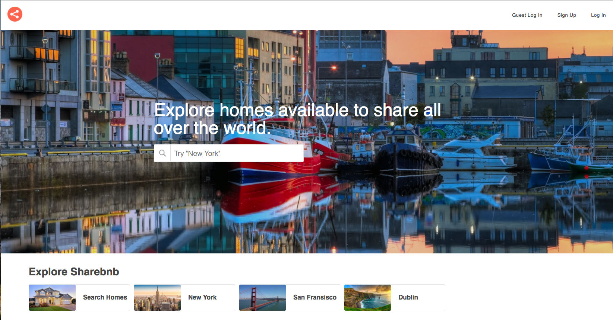
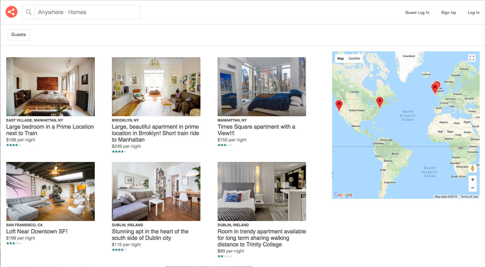
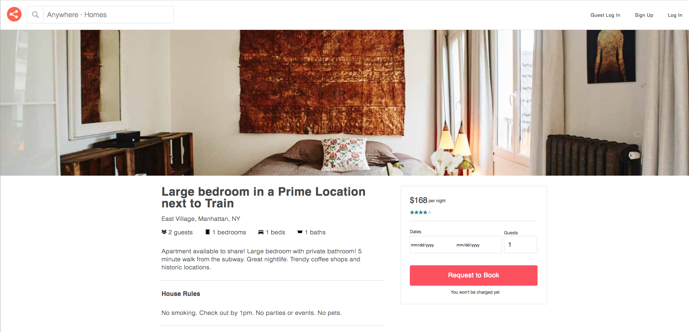
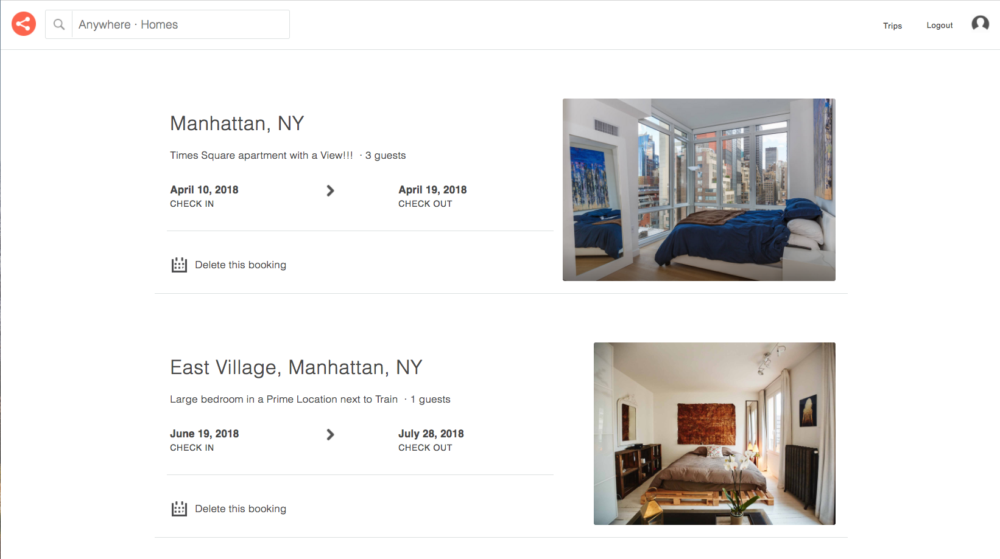
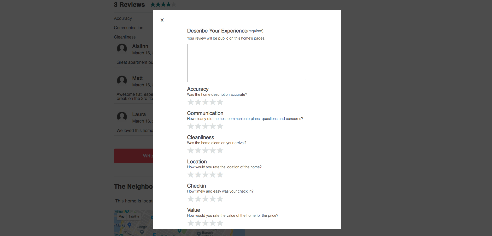

# Sharebnb

[Sharebnb Live](http://sharebnbbb.herokuapp.com/#/)

Sharebnb is a full-stack, single-page application inspired by Airbnb used for booking short-term accomodation.  Sharebnb was built using a PostgreSQL database, a Ruby on Rails backend and React/Redux on the front-end. It features homes that users can view, book and review.  Users can search for homes by location through the search bar or by clicking on a specific home on the map.  Users can also filter the homes by number of guests.  

A guest login feature is available to check out the website without going through the signup process.

Homepage

Users begin at the home page where they can view homes whether they are logged in or not.  Buttons in the top right corner open modals that allow the user to login or signup.  A guest login option is available for demonstration.  Users can explore homes by scrolling through them on the homepages, typing a location to search in the search bar or clicking on the buttons that link to pre-selected locations.  At any time, the user can click the logo in the top left corner to navigate to the homepage.

Search page with map

The search page can be reached by entering a location into the search bar or by clicking one of the explore buttons.  From here, users can view all of the homes available at that location on the map.  This map is implemented using the Google maps API.  Users can update the current location by entering a new location ito the search bar.  Users can also filter home results by entering the number of guests in their party.  All of the homes in the search page display the home's picture, title, price and average rating from 1-5 stars. User can navigate to the home's show page by clicking on the image/title of the home or by clicking on its icon on the map.

Home show page

Each home has a show page that displays the home's picture, title, location, price and other relevant information.  This page also contains the booking form that allows users to request to stay at this home.  The show page also contains all of the reviews that have been made on the home and a button linking to the review form. Users must be logged in to create a booking or write a review on a home. At the bottom of each show page there is a small map that is zoomed in and show the home's neighborhood and the home's exact location.

Booked trips page

A user, when logged in, can navigate to their 'Trips' page and see all of their upcoming trips that have been booked.  This page shows the dates of the bookings, the number of guests, the home's title, picture and location . Each booking can be deleted only by the user who created it.

Home review form

Each home's show page contains a 'Write a Review' button.  If logged in, a user can click this button and a review form modal will appear.  The user can rate the home from 1 to 5 stars in six selected categories and leave a written description.  Each review will be displayed on the home's show page. The ratings from all reviews for each category will be averaged for each home and displayed at the top of the ratings section.  The average rating for each home will also be displayed with each home's title and price on the home adn search pages.

## Features
 
* User Authentication 
* Login/signup forms displayed in modal windows
* Homes index and show pages
* Search homes using search bar or map
* Filter homes by number of guests
* Make bookings for homes
* View all bookings on trips page
* Write reviews on homes

## Languages

* Ruby
* JavaScript
* HTML/CSS 

# Frameworks, Libraries, Gems and Services

* Rails
* React
* Redux
* jQuery
* AWS (S3)
* Paperclip
* Jbuilder
* BCrypt

# To Do

Things I plan to work on next: 

* Saved trips feature where users can star homes that they like but do not want to book yet
* Host profile pages and ratings
* Allow users to edit bookings
